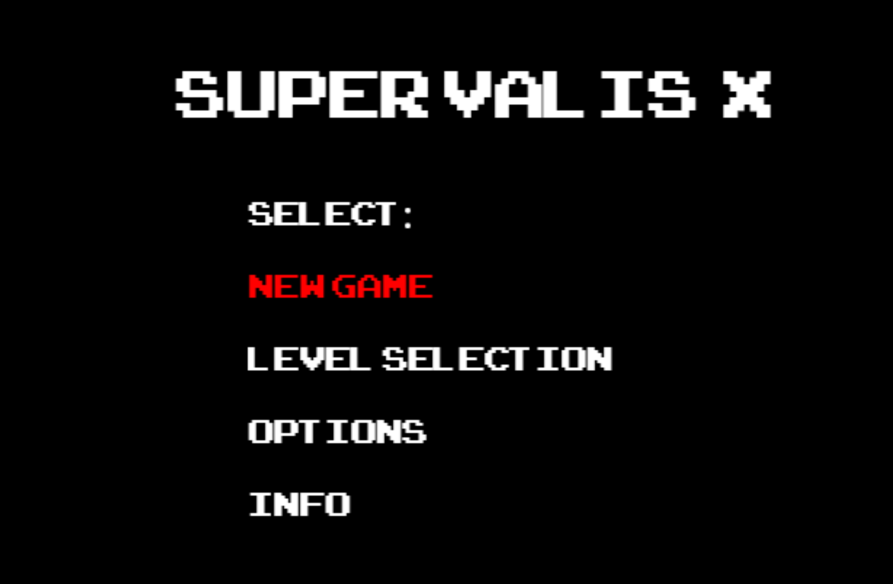
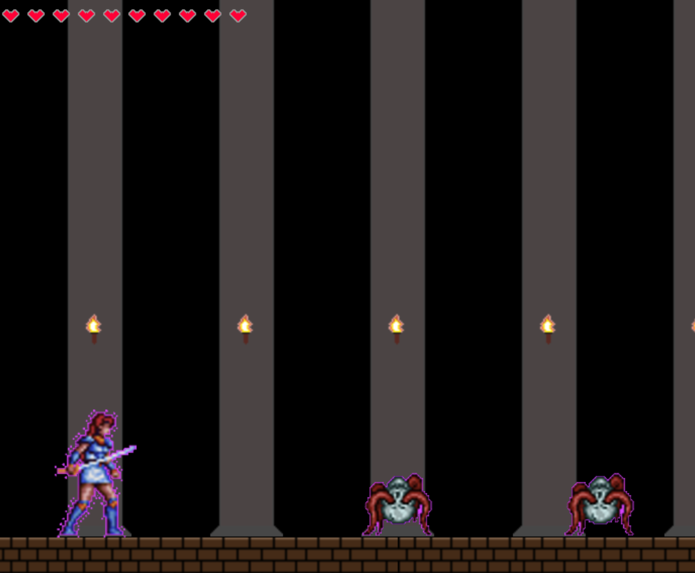
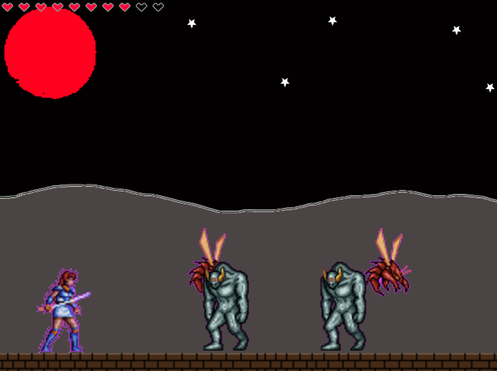
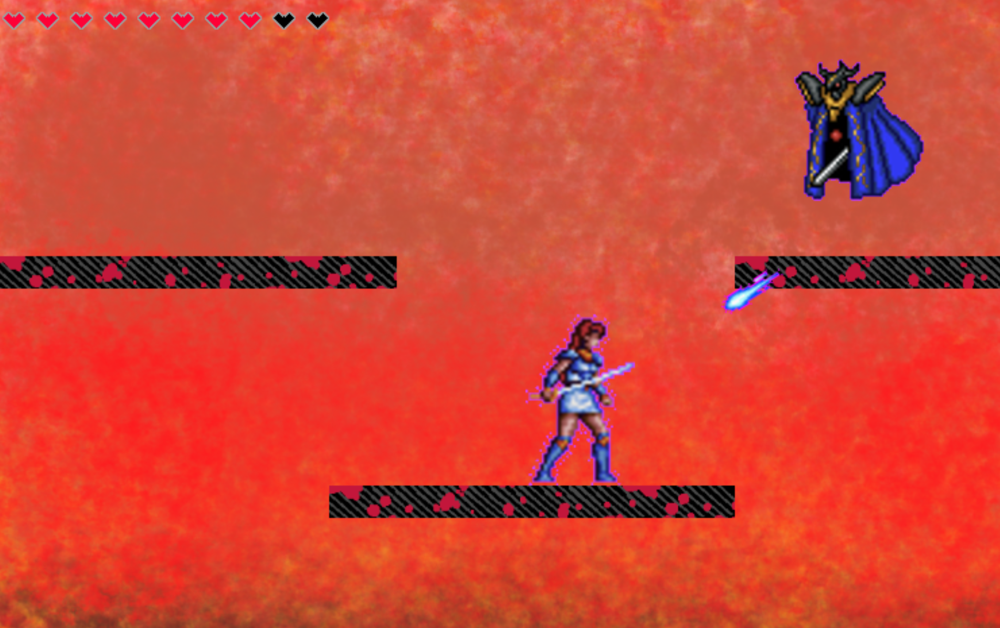
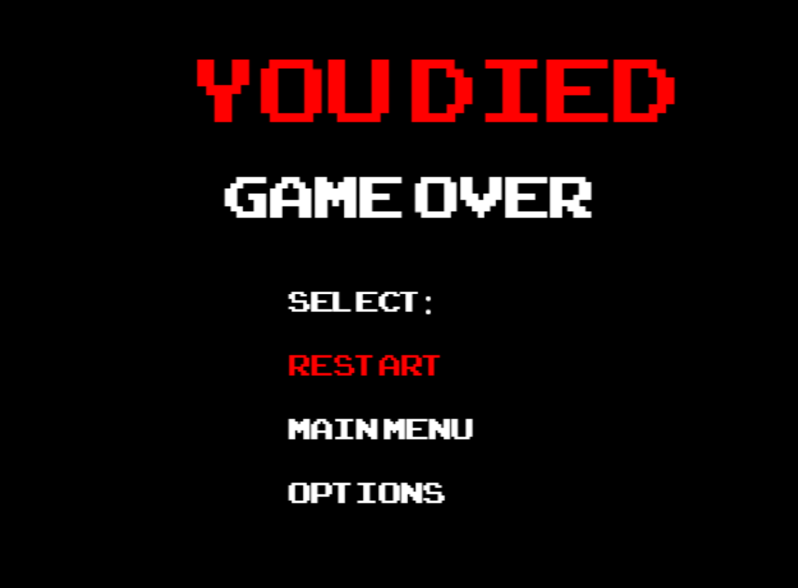

# IWP-Project

 The Course Project of the Introduction to the Web Programming course © Sami Anttalainen

**Here is the link to the PDF report!**
[Project Report](./pdf/IWP-project.pdf)

## Development

The game project was build using bottom up approach, so I did not have any clear plan what I wanted to do and the game just evolved naturally to its current form. I started building the game procedurally, but recognized shortly after that object oriented programming would be beneficial for this project, so I refactored the code base to the OOP paradigm format. Yes, there probably should have been more classes like Boss class for bosses which inherits Enemy class or Level class for other levels etc., because it looks good in the UML diagram, but I think it would have just added unnecessary abstraction to the code and benefits would have been minimal.

## Scrapped ideas

The game was supposed to have four maps, but it was scrapped due to deadline requirements. The game was also supposed to have more enemies and bosses, but due to the game's physics engine or my skill issue or both they were cut off from the game. I also wanted to develop more player classes to the game, but it would have required more planning to the game mechanics etc. so that idea was scrapped quite quickly.

## Known bugs

* Player's attack animations do not work correctly due to the game's physics engine or my skill issue
* Sometimes custom font does not load when launching the game
* Sometimes player might collide in burst with the enemy and immediately die (Most likely happens if player jumps on enemy or vice versa)

## Screenshots of the game

Main menu

Map 1

Map 2

Map 3

Game Over screen

